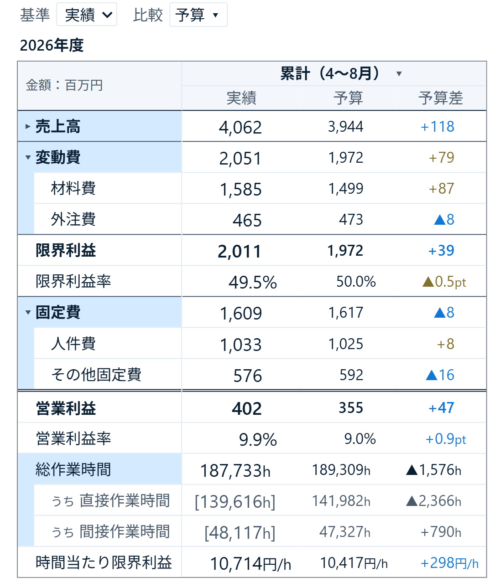
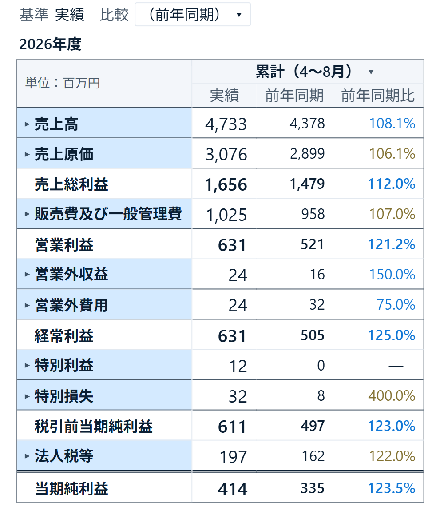
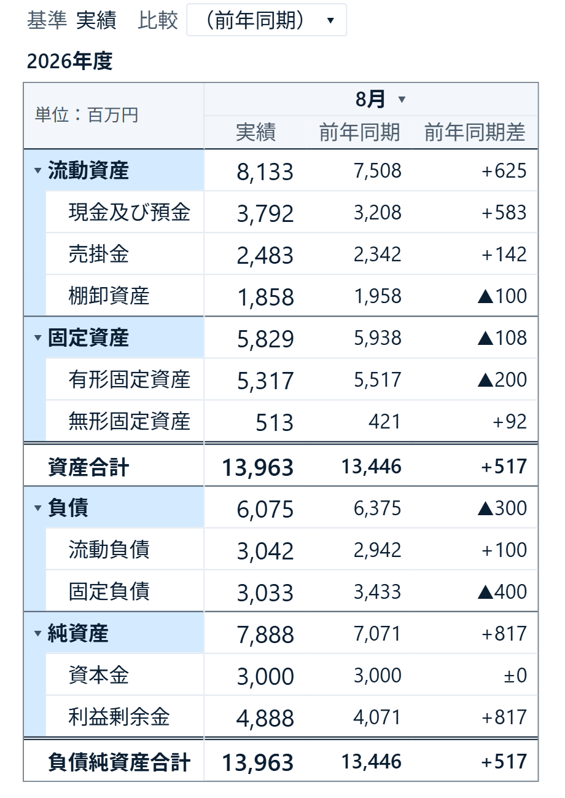

# 予実表 by itoken lab

Power BIに追加して使う、実績・予算・見通しを比較する無料のカスタムビジュアルです。科目や商品などの行ごとに金額を集計し、書式ペインの設定で営業利益や利益率などの計算の行を足せます。損益計算書・貸借対照表・事業別の管理会計のほか、商品別の売上やKPIの予実にも使えます。

金額に加えて時間・人数などの指標を並べ、時間当たりの利益も表示できます。行の階層（区分 → 科目など）と、事業・部門などのセグメントの階層は、それぞれ開閉でき、合計の位置や表の分け方を選べます。



画像は架空のデータによる表示例です。数値は表示桁数で丸めるため、表示値の足し算や差が合計・差額と一致しない場合があります。サンプルのレポートファイルとデータは配布していません。

画像の水色は行のまとまり、名前の左の三角は開閉操作です。数値の前の「▲」はマイナス、角括弧の時間は「うち」の行です。「うち」は親の行の内訳として1段下げて出す行で、親の合計には足しません。差の青は改善、茶色は悪化です。例えば売上の増加は青、費用の増加は茶色になります。色と負数の記号は書式で変更できます。

## 1.x から更新する方へ

初めて使う方は、この節を飛ばしてかまいません。2.0 の主な変更は次のとおりです（全部は[更新履歴](CHANGELOG.md)）。

- 行・月・貸方フラグの欄が任意になりました。値のメジャーだけを入れると、全期間の合計の1行が出ます。行の欄は0〜5段まで入れられます。
- 欄と書式ペインの名前を、会計以外の表でも読める言葉にしました（科目 → 行、主 → 基準、比較順 → シナリオの順序、計算の行 → 計算行など）。
- 書式ペインを対象ごとのカード（シナリオの列・期間の列・行・セグメント・計算行・指標・数値・行別の数値書式・表全体）に組み直しました。表はいつも階層の配置で描きます。
- 「行を選ぶ」で、合計行や小計の行も「その他」「うち」の親・子にできます。

**1.x の書式ペインで設定した値は、2.0 に引き継がれません。** カードと項目の名前が変わったためです。2.0 に更新したら、書式ペインで設定し直してください。フィールドの割り当てはそのまま使えます。

## インストール

1. [Releases](https://github.com/itoken-lab-jp/financial-table/releases)の最新版を開き、「Assets」の `financial-table-2.0.0.0.pbiviz` をダウンロードします。これがビジュアル本体です。「Source code」のzipは改造する人向けで、取り込みには使いません。
2. Power BI Desktopの「視覚化」ペインで「…」を押し、「ビジュアルをファイルからインポート」を選びます。
3. 取り込んだ「予実表 by itoken lab」のアイコンを押し、レポートに置きます。

更新も同じ手順です。既存のビジュアルを更新する確認に同意すると、新しい版に置き換わります。モデルのデータを入れ替える操作ではありません。組織の設定によって、ファイルからのカスタムビジュアルの取り込みが制限される場合があります。

## 最初の表を作る

いちばん小さい表は、「値」に金額のメジャーを入れるだけで出ます。全期間の合計の1行です。ここに欄を足していくと、表が細かくなります。

- 「行」に商品名や科目名の列を入れると、行ごとに分かれ、最後に合計行が付きます。
- 「月」に日付または `2026-04` のような月の列を入れると、月・四半期・通期の列になります。
- 「値」に実績と予算の2つのメジャーを入れると、比べられます。表の上の「基準」は表の中心に出す値、「比較」は比べる相手のボタンです。「基準」で実績、「比較」で予算と見せ方の「差」を選ぶと、実績−予算が出ます。

会計の表（損益計算書・貸借対照表）を作るときは、次のように科目マスタを用意します。小計や営業利益の行をデータに重ねて入れないでください。小計はビジュアルが計算します。

| 区分 | 科目名 | 貸方フラグ | 残高フラグ |
| --- | --- | ---: | ---: |
| 売上高 | 商品売上 | 1 | 0 |
| 売上原価 | 商品原価 | 0 | 0 |
| 販管費 | 人件費 | 0 | 0 |

「貸方フラグ」は科目の性質を表す列で、収益・負債・純資産を1、費用・資産を0にします。元の金額が正か負かとは別の情報です。「残高フラグ」は期間末の残高を表示する科目を1、期間中の金額を合計する科目を0にします。このPLの例はすべて0です。1・0のほか、true・falseの列でも受けます。

1. 「行」に **区分 → 科目名** の順で列を入れます。中分類があれば間に入れます。
2. 「貸方フラグ」と「残高フラグ」に上記の列を入れます。
3. 科目マスタに「区分順」「科目順」の数値列を用意します。区分順は売上高1・売上原価2・販管費3とし、同じ区分の科目には同じ区分順を入れます。モデルで区分列の「列で並べ替え」に区分順、科目名列には科目順を指定します。
4. 書式ペインの「計算行」で、編集対象の「計算行 1」の種類を「小計」、名前を「営業利益」にします。「開始位置」で売上高、「終了位置」で販管費を選ぶと、この両端を含む範囲から利益を計算し、販管費の後に表示します。例えば売上高1,000、売上原価600、販管費200なら営業利益は200です。

「数値」カードの「符号の持ち方」は、メジャーが返す元の金額をどう解釈するかの設定です。

| 元の金額の例 | 選ぶ設定 |
| --- | --- |
| 売上−1,000、費用＋600 | 借方プラス |
| 売上＋1,000、費用−600 | 貸方プラス |
| 売上＋1,000、費用＋600 | すべてプラス |

既定の「自動」は、シナリオごとに貸方・借方の科目の合計の符号から判定します。まず金額が分かっている月の売上・費用・利益を照合し、逆向きなら上の表に従って指定します。**貸方フラグの空欄は0と同じではありません。** 空欄は所属する区分の向きを継ぐので、区分と逆向きの科目（減価償却累計額など）を空欄にすると符号が逆になります。会計の表を作るときは、全科目にその性質に合う0か1を入れてください。

貸方フラグの欄を入れない表では、メジャーが返した値のまま足し、差がプラスなら良い向きとして色を付けます。会計以外の表（商品別の売上など）はこちらで使います。費用を含む表なら、売上をプラス、費用をマイナスで持つメジャーを入れると、合計が利益になります。

## フィールドの入れ方

| 欄 | 入れるもの |
| --- | --- |
| 行 | 任意。上の段から最大5段（例：区分 → 中分類 → 科目名、商品分類 → 商品）。一番下の段が行の名前で、上の段ごとに小計を付ける。入れなければ合計の1行 |
| 行コード | 任意。行を識別するコード。省略すると上の段からの名前の組み合わせで識別 |
| 行の順序 | 任意。行の並びの数値列。並びはモデルの「列で並べ替え」の順で、セグメントやシナリオごとに行の顔ぶれが違い、全体の順序を決めにくい場合に指定する |
| 残高フラグ | 任意。残高を表示する行は1。四半期などで月を足さず、期間の最後の月の値を表示 |
| 貸方フラグ | 任意。会計の表で、正常な残高が貸方の科目は1、借方は0 |
| 月 | 任意。日付または `2026-04` 形式の文字。入れなければ全期間の1列。前年同期との比較には前年の月も含める |
| シナリオ | 任意。実績・予算・見通しなどを分ける列。列を使う場合は、対応する金額を「値」に入れる |
| シナリオの順序 | 任意。シナリオの確かさの順（例：予算1・見通し2・実績3）。後ろほど確かで、「最新見込み」で先に採る |
| セグメント | 任意。会社 → 事業 → 部門など、上から最大3段 |
| 値 | 必須。金額のメジャー。「シナリオ」を使わない場合は、複数のメジャー名をシナリオとして扱う |
| 指標 | 任意。時間・人数・台数などのメジャー。金額とは別の行に表示する |

実績と予算を渡す方法は2通りです。実績金額・予算金額のようにメジャーが分かれていれば、その両方を「値」に入れ、「シナリオ」は空にします。1つの金額列に実績・予算の行が混ざっていれば、それを区別する列を「シナリオ」に、金額の合計メジャーを「値」に入れます。

「最新見込み」は、セグメント・月などの単位ごとに、値があるシナリオのうち順序の後ろのものを選んで組み合わせます。例えば予算1・見通し2・実績3なら、実績が届いた月は実績、未到着なら見通し、それもなければ予算を使います。期の途中で、年度の着地を予算と比べるときに使います。基準・比較の選択肢では、データのシナリオと見分けられるよう「（最新見込み）」「（前年同期）」とかっこで囲んで出します。メジャーを分けた場合のシナリオの順序は書式の「シナリオ（メジャーごと）」で設定します。

## 比較・期間・計算

- 表の上の「比較」で、最大3列の比較対象と見せ方（値・差・比など）を選べます。基準が実績、相手が予算なら「比」は実績÷予算、「率」は（実績−予算）÷|予算| を百分率で表示します。「通期」「4月」などの期間名の横のメニューでは、その期間だけ比較相手や差・比の表示を変更できます。
- 表の上の「期間を選ぶ」は、どの月・四半期・通期を表に出すかの選択です。期首月や年度の表記は書式の「期間の列」で設定します。年度は表の上か、左上の角（期間の見出しと同じ段）に置けます。表示する期間を隠しても比較用データは残りますが、レポートのフィルターで前年同期のデータを除外すると、前年との比較はできません。
- 表の上の「行を選ぶ」で、親の行ごとに見せる行を選び、残りを「その他」にまとめるか、選んだ行を親の「うち」にできます。例えば販管費の大きい3科目だけを見せて、残りを「その他」の1行にまとめられます。合計行や小計の行も親・子にできます。
- 「計算行」で、小計や比率を最大20行設定できます。営業利益率なら、空いている設定の種類を「比率」、名前を「営業利益率」にし、分子の選択肢から営業利益、分母から売上高を選びます。「挿入位置」で営業利益を選ぶと、その行の後に比率が出ます。
- 「指標」で、メジャーごとに挿入位置・配置（行の後ろか、行のうち）・期間の集計方法・数値書式を設定します。「計算行」の分子に利益、分母に時間の行を選び、書式を `#,0円/h` にすると時間当たり利益を表示できます。比率の既定の書式はパーセントなので、計算行の「書式」で単位に合わせて変更します。





BSの例は8月末の残高と前年同月末を比較しています。残高フラグを1にした科目では、四半期・通期に切り替えても月の残高を足さず、その期間の最後の月の値を表示します。

## 階層の見せ方

書式の「行」と「セグメント」のカードで、それぞれの見せ方を選びます。

| 設定 | 選べる見せ方 |
| --- | --- |
| 表示 | 囲みなし：行として続ける／囲み：親の色帯で子を囲む／分割：見出し帯と表を分ける／横積み：親・子の名前を別の列に置く |
| 展開時の合計 | なし／上／下。「なし」でも、畳むとその範囲の集計を表示 |
| 分割の向き | 縦／左右。同じ親の子ごとの表を、縦か左右に並べる |

迷ったら既定（行は囲み・合計は下）のまま使い、見え方を変えたくなったら選び直してください。「横積み」は親・子の名前を左から階層列に並べる形で、「左右」の分割は表そのものを横に並べる形です。「段・行ごとの配置」で、段や行ごとに最大20件まで上書きできます。例えば事業ごとに表を分割し、その中の科目を囲み表示にできます。

「行」カードの「計算行を親にする」を入れると、売上総利益・営業利益などの計算行が、足す範囲の区分の親になります。損益計算書が段階利益の入れ子になり、横積みで親の名前を左に並べられます。

## 操作・書式

- 開閉印で階層を畳み、行や数値をクリックして他のビジュアルに選択を伝えます。右クリックでPower BIのコンテキストメニューを開けます。
- 表の中は矢印キーで移動でき、Shift＋左右キーで階層を開閉できます。
- 色・罫線・文字サイズ・表示単位・小数桁数を変更できます。単位は表の右上・左上の角・行の名前の横・数字のあとに置けます。「行別の数値書式」で、段や行ごとに表示単位・桁数・書式を変えられます。
- 数字の太字は、既定では計算行（利益・合計）だけです。「行」カードの「集計の数字を太字」で、区分・中分類の数字も太字にできます。
- 差の色は、収益なら増加、費用なら減少を改善として扱います。計算行や指標は、そのカードの「良し悪し」で向きを選べます。
- マウスを乗せると現れる「画像としてコピー」で、表示中の範囲を画像にできます。スクロールの外にある部分は入りません。

## 対応範囲

表示言語は日本語です。開発時の確認環境はPower BI Desktop 2.158.1177.0（2026年9月）です。Power BIサービス、PDF出力、すべてのテーマでの表示は未検証です。サービスでの共有やPDF配布を予定している場合は、その環境での表示・操作を採用前に確認してください。

## ソースからビルドする

この手順はソースを変更する人向けです。配布済みの `.pbiviz` を取り込んで使うだけなら不要です。Node.js 22系（動作確認済み）とnpmを用意し、このリポジトリで実行します。ビルドに必要なPower BIのツールも依存に含まれます。package.jsonの最低条件はNode.js 20以上ですが、配布時のビルド検証は22系で行っています。

```sh
npm ci
npm run typecheck
npm run package
```

`dist/` に `.pbiviz` ができます。

## ライセンス・問い合わせ

pbivizは無料で配布し、ソースは[MITライセンス](LICENSE)で公開しています。商用利用・改変・再配布ができます（無保証）。依存ライブラリのライセンスは[THIRD_PARTY_NOTICES.md](THIRD_PARTY_NOTICES.md)を参照してください。

不具合や質問は[Issues](https://github.com/itoken-lab-jp/financial-table/issues)へお願いします。個別の相談や開発の依頼はお受けしていません。
